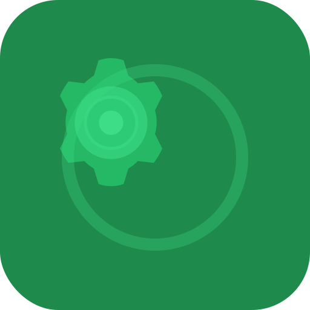

# Contributing to bots.pm



[](https://www.electronjs.org/)
[](https://nodejs.org/)
[](https://www.webcomponents.org/)
[](https://pptr.dev/)
[](https://www.sqlite.org/)

Thank you for considering contributing to bots.pm! This document provides guidelines and instructions for contributing to the project.

## Code of Conduct

Please read our [Code of Conduct](CODE_OF_CONDUCT.md) before participating in this project.

## How Can I Contribute?

### Reporting Bugs

Before creating bug reports, please check the issue tracker to see if the problem has already been reported. If it has and the issue is still open, add a comment to the existing issue instead of opening a new one.

When you are creating a bug report, please include as many details as possible:

- **Use a clear and descriptive title** for the issue
- **Describe the exact steps to reproduce the problem**
- **Provide specific examples** to demonstrate the steps
- **Describe the behavior you observed** after following the steps
- **Explain which behavior you expected to see instead**
- **Include screenshots or animated GIFs** if possible
- **Include details about your environment** (OS, Node.js version, etc.)

### Suggesting Enhancements

Enhancement suggestions are tracked as GitHub issues. When creating an enhancement suggestion, please include:

- **Use a clear and descriptive title** for the issue
- **Provide a step-by-step description of the suggested enhancement**
- **Provide specific examples** to demonstrate the steps
- **Describe the current behavior** and **explain which behavior you expected to see instead**
- **Explain why this enhancement would be useful** to most bots.pm users

### Pull Requests

- Fill in the required template
- Follow the style guidelines
- Document new code
- Include tests when adding new features
- Update documentation when changing existing functionality
- Make sure all tests pass

## Development Setup

### Prerequisites

- Node.js (v16.0.0 or higher)
- pnpm (v8.0.0 or higher)
- FFmpeg (for audio/video processing)

### Setup

1. Fork the repository
2. Clone your fork:
   ```bash
   git clone https://github.com/yourusername/botspm.git
   cd botspm
   ```

3. Install dependencies:
   ```bash
   pnpm install
   ```

4. Create a `.env` file based on the provided `.env.sample`:
   ```bash
   cp .env.sample .env
   ```

5. Run the setup script:
   ```bash
   pnpm setup
   ```

6. Start the development server:
   ```bash
   pnpm dev
   ```

## Project Structure

```
botspm/
├── assets/            # Application assets (icons, images)
├── bin/               # Binary scripts
├── data/              # Application data storage
├── public/            # Public static files
├── scripts/           # Utility scripts
├── src/               # Source code
│   ├── ui/            # UI components and frontend logic
│   │   ├── components/  # Web components
│   │   └── app.js       # Main application logic
│   ├── main.js        # Electron main process
│   ├── master.js      # Bot management logic
│   └── preload.js     # Electron preload script
└── config.json        # Application configuration
```

## Coding Guidelines

### JavaScript

- Use ES6+ features
- Use async/await for asynchronous operations
- Follow the existing code style
- Document your code with JSDoc comments

### Web Components

- Use custom elements for UI components
- Follow the Shadow DOM encapsulation pattern
- Use descriptive names for components and properties
- Keep components focused on a single responsibility

### CSS

- Use CSS variables for theming
- Follow BEM naming convention
- Ensure styles work in both light and dark mode

## Testing

Run tests with:

```bash
pnpm test
```

## Building

Build the application with:

```bash
pnpm build
```

## Releasing

To create a new release:

1. Update the version in `package.json`
2. Ensure your `.env` file contains GitHub credentials
3. Run the release script:
   ```bash
   pnpm release
   ```

## Documentation

- Update documentation when adding or changing features
- Use clear and concise language
- Include examples where appropriate

## License

By contributing to bots.pm, you agree that your contributions will be licensed under the project's MIT License.